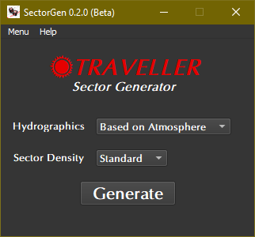

.. image:: https://img.shields.io/github/stars/ShawnDriscoll/Traveller-RPG-SectorGen.svg
	:target: https://github.com/ShawnDriscoll/Traveller-RPG-SectorGen/stargazers
	

**Traveller RPG SectorGen**
===========================

**Traveller RPG SectorGen** is a Windows program for generating sectors, based on rules from Mongoose Traveller 2nd Edition.

New in v0.2.1b
--------------

Chance of Super-Earths being generated.
This Traveller 5 rule was previously removed, but then put back in as an option.

Notes
-----

**Traveller RPG SectorGen** is being developed using Python 3.9.7 and PyQt5.
There are a few Python programs included.

``SectorGen.py`` will generate a sector at origin 0,0. The sector density can be selected. It
will create both raw CSV and JSON data files, and a Traveller 5 format sector file as well.

(Optional) ``CSV_to_GEnie_converter.py`` will create a GEnie format file from the raw sector data generated.

(Optional) ``PyMapGen.py`` will read the Traveller 5 format sector file and display it graphically using PyGame.

(Optional) ``CSV_to_WBS_converter.py`` will create an H&E WBS format file from the raw sector data generated.

Requirements
------------

* **Windows 10**

  It might not work in OSX or Linux.

* **Python 3.9.7**
   
  This code was written using the C implementation of Python version 3.9.7. Also known as CPython.

* **colorama 0.4.4**

  Because CMD may have some colored text messages for debugging invalid die rolls.
   
* **PyQt5 5.15.4**

  PyQt5 is the framework used for displaying the Window GUI and buttons, etc.

* (Optional) **pyttsx3 2.90**

  PyMapGen speaks in Zira's voice (her voice comes with Windows). Can be changed to a different voice in the source.

* (Optional) **pygame 2.1.0**

  PyGame is used to draw the maps. It's basically a Python wrapper for SDL 2.0.16, which PyGame includes.

Warning
-------

This code will not work with **Python 2.7-**.

PyMapGen Usage
--------------

Click on a sector to center it.

Dragging a sector (or pressing the arrow keys) will scroll the map.

The mouse wheel will zoom the map in and out while pointing.

Pressing ``m`` will toggle the computer's voice on/off.

Pressing ``h`` will flip to a hex map(s) at different zoom levels.

Pressing ``r`` will flip to a rectangle map.

Pressing ``c`` will toggle solid/clear travel zones while zoomed in.

Pressing ``z`` will toggle circle/hex/rectangle travel zones while zoomed in.

Pressing ``t`` will toggle world UWP/TC while zoomed in.

Pressing ``l`` will toggle the world system locations on/off.

Pressing ``g`` will toggle the hex/rectangle grid on/off.

Pressing ``ESC`` will exit the program.

Not Using Python?
-----------------

You can always run the .EXE versions for Windows 10 if you don't have the Python language installed.

The Traveller game in all forms is owned by Far Future Enterprises. Copyright 1977 - 2022 Far Future Enterprises. Traveller is a registered trademark of Far Future Enterprises.

Contact
-------
Questions? Please contact shawndriscoll@hotmail.com
