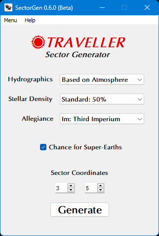

**Traveller RPG SectorGen**
===========================

**Traveller RPG SectorGen** is a Windows program for generating sectors, based on rules from
Mongoose Traveller Second Edition and Traveller 5.10.

Notes
-----

**Traveller RPG SectorGen** is being developed using Python 3.11.6 and PyQt5.
There are a few Python programs included.

``SectorGen.py`` will generate a sector at a coordinate chosen. The sector density can be selected. It
will create temporary raw CSV and JSON data files of the last sector generated. Traveller 5 format sector files are generated for each coordinate chosen.

(Optional) ``CSV_to_GEnie_converter.py`` will create a GEnie format file from the raw sector data generated.

(Optional) ``PyMapGen.py`` will read the Traveller 5 format sector file and display it graphically using PyGame.

(Optional) ``CSV_to_WBS_converter.py`` will create an H&E WBS format file from the raw sector data generated.

Requirements
------------

* **Windows 11**

  Has been tested with Windows 10.

* **Python 3.11.6**

  This code was written using the C implementation of Python version 3.11. Also known as CPython.

* **PyQt5 5.15.9**

  PyQt5 is the framework used for displaying the Window GUI and buttons, etc.

* (Optional) **pyttsx3 2.90**

  PyMapGen speaks in Zira's voice (her voice comes with Windows). Can be changed to a different voice in the source.

* (Optional) **pygame 2.4.0**

  PyGame is used to draw the maps. It's basically a Python wrapper for SDL 2.26.4, which PyGame includes.

PyMapGen Usage
--------------

Click on a sector to center it.

Dragging a sector (or pressing the arrow keys) will scroll the map.

The ``mouse wheel`` will zoom the map in and out while pointing.

Pressing ``0`` will mute the computer's voice.

Pressing ``1 - 9`` will choose the computer's voice shown in the list.

Pressing ``h`` will flip to a hex map(s) at different zoom levels.

Pressing ``r`` will flip to a rectangle map.

Pressing ``c`` will toggle solid/clear travel zones while zoomed in.

Pressing ``z`` will toggle circle/hex/rectangle travel zones while zoomed in.

Pressing ``t`` will toggle world UWP/TC while zoomed in.

Pressing ``l`` will toggle the world system locations on/off.

Pressing ``g`` will toggle the hex/rectangle grid on/off.

Pressing ``ESC`` will exit the program.

Things To-Do
------------

| Printing PDFs from the PyMapGen screen.
| Add more world types.
| Add trade routes.
| Instruction manual.
| Add proper allegiance distribution across a sector.
| Cheat codes.

Known History
-------------

* v0.6.0b

  Sector coordinates (for trailing and rimward) can now be entered before sector generation.

* v0.5.7b

  World name suffix has been added for duplicates.

* v0.5.6b

  Trade codes can be Unknown now.

* v0.5.5b

  Updated to Python 3.11.0.

* v0.5.1b

  Replaced PyDiceroll with newer pydice module.

* v0.5.0b

  Removed requirement for colorama.

* v0.4.0b

  Allegiance selection has been added.

  Sector Density is now Stellar Density (in accordance with T5). Its range was increased, and uses percentages now.

  Small edits made to Sector naming.

* v0.3.1b

  Corrected values for starports.

* v0.3.0b

  A differentiation has now been made between barren and dieback worlds. New graphic will follow for PyMapGen.

* v0.2.3b

  Sector Density DM is now properly logged.

* v0.2.2b

  Now displays number of worlds generated. Helps with letting user know that sector generation has completed.

* v0.2.1b

  A CSV to WBS converter is included for creating H&E WBS formatted files.
  
  Chance of Super-Earths being generated. This Traveller 5 rule was previously removed, but then put back in as an option.
  
  Added number of worlds for each system.

* v0.2.0b

  Sectors are now generated in Traveller 5 format.
  
  A lot of the Traveller 5 world generation rules were removed, while keeping the Mongoose Traveller 2nd Edition rules. No more 3,000 trillion population sectors.

* v0.0.1b

  Initial release.

The Traveller game in all forms is owned by Far Future Enterprises. Copyright 1977 - 2024 Far Future Enterprises. Traveller is a registered trademark of Far Future Enterprises.

Contact
-------
Questions? Please contact shawndriscoll@hotmail.com
